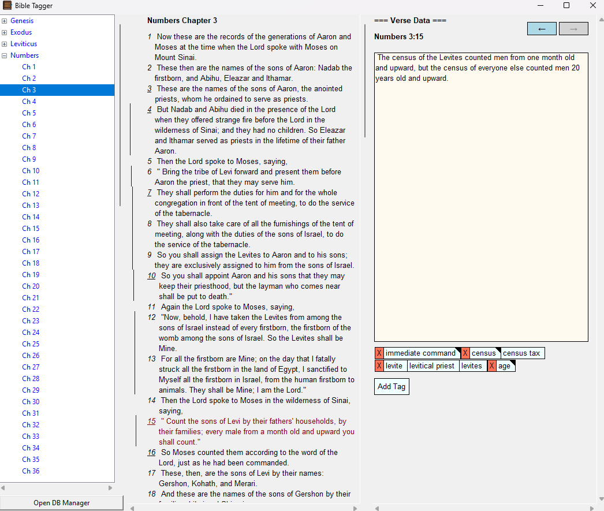
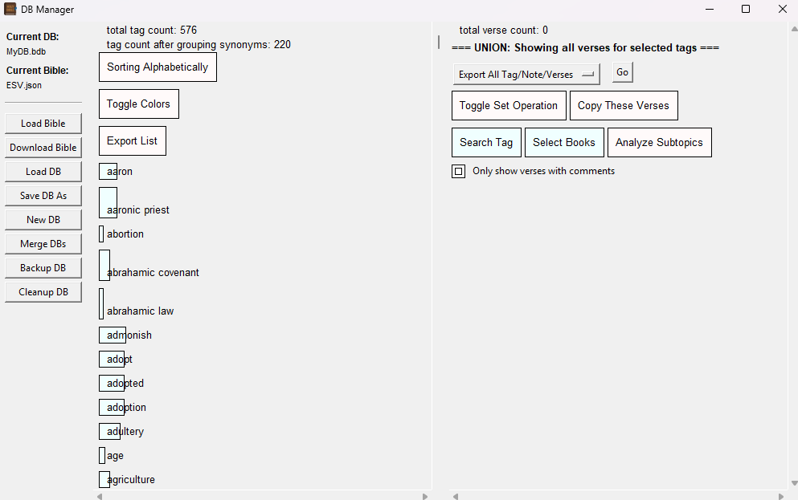
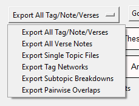

# Bible Tagger

A powerful tool for generating topical Bible concordances with notes and tags. Load a JSON Bible translation, add notes and tags to verses or passages, and organize your biblical study materials.

## Key Features

### Tag Management
- Create topical tags for verses or verse ranges
- Link synonymous tags together (e.g., "skin disease" and "leprosy") to view all related verses
- Add notes to both verses and tags
- View all verses associated with a tag in one place

### Interface
Bible Tagger uses a 3-column resizable TKinter interface:
- **Left Column**: Tree navigation for books and chapters
- **Middle Column**: Chapter text with visual indicators (vertical lines) showing which verses have notes or tags. Click verses individually or Shift-click to select ranges. Footnotes and cross-references appear below the chapter text.
- **Right Column**: Displays selected verse(s), related verses, associated notes, and tag list
- **DB Manager Window**: Access database analysis tools, merge databases, download new Bible translations

### Bible Features
- **Footnotes**: Hover over underlined verse numbers to see footnotes (if available in translation)
- **Cross-References**: View translation-provided cickable cross-references at the bottom of each chapter
- **Multiple Translations**: Switch between different Bible versions
- **Download Translations**: Built-in Bible downloader supporting most of the common english versions (ESV, NIV, NASB, KJV, etc.)

### Database Features
- SQLite-based storage with automatic version migration
- Merge multiple databases together
- Export analysis to Excel format
- Backup and restore functionality

## Database

Bible Tagger stores all your tags, notes, and verse annotations in a SQLite database (.bdb files). The database automatically migrates to newer versions when needed, creating backups before migration.

### The Main window

### The DB Analysis window

### Contents of the dropdown list for analysis exports

## External Dependencies

### Bible Data Format
Bible Tagger uses JSON-formatted Bible translations. On first time use you can open the DB manager to download a version to use.

## Known Issues

- **Cross-Translation Compatibility**: If you create a database with a Bible that includes additional books (e.g., Apocrypha) and later open it with a standard Bible, book indexing may cause errors. This can also affect translations with missing verses (e.g., KJV vs NIV).

## Future Enhancements

- Need universally unique way to identify book/chapter/verse across translations and even languages
    - Make verse references in the DB more explicit so that the tool will accommodate switching between translations with missing verses
- History smart replace
    - Clicking a single verse, adding or deleting a tag or editing a note, then shift-clicking another verse keeps both. eg. Genesis 1:1 -> Genesis 1:1-5
    - Clicking a single, not doing anything with it and then shift-clicking another replaces it in the history. Only Genesis 1:1-5 should be in history

# Getting Started

### Required Packages
- `tkinter` - GUI framework (usually included with Python)
- `openpyxl` - Excel file generation
- `numpy` - Numerical operations for analysis
- `networkx` - Graph analysis for tag relationships
- `matplotlib` - Visualization for analysis exports
- `configparser` - Configuration file handling
- `beautifulsoup4` - HTML parsing for Bible downloads
- `requests` - HTTP requests for Bible downloads
- `json` - JSON handling library

### Running

1) Rename the config template (it should be config.cfg)
2) Run bible_tagger.py
    1) On first run, it will create a DB for you, but it will not load a bible.
3) Open DB Manager from the button bottom left
4) Select either Load Bible or Download Bible
    1) Downloading a bible requires the version name (e.g. ESV)
    2) This process takes some time, like 10 minutes.
    3) After scraping is done, resolve any translation discrepancies
    4) Select Load Bible afterwards, it should be named VER.json, where VER is the version name
