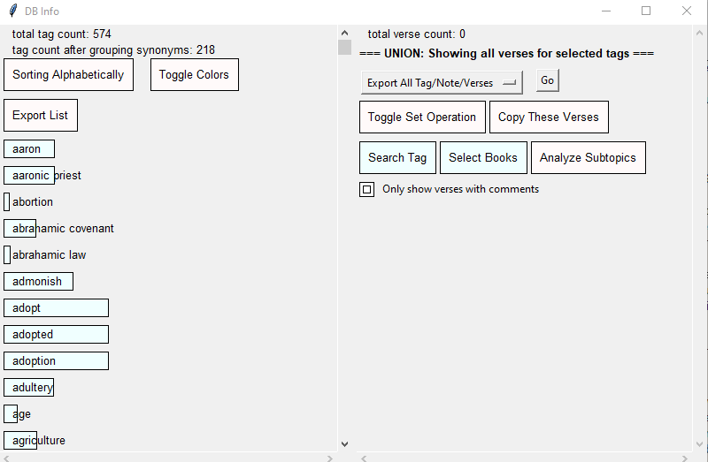
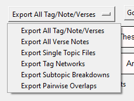

# Bible Tagger

This is a tool for generating topical Bible concordances with notes. It loads a JSON bible of your choice, and then lets you add notes and "tags" to verses or passages. If you click a tag, it'll show all the verses associated with that tag, and let you associate that tag with synonymous tags so that you get all the verses for all of those tags in one place. (e.g. maybe you made a tag called "skin disease" on a bunch of verses and another tag called "leprosy" on a bunch of other verses, and you decide you want them to actually be in the same category; you would just mark them as synonyms). You can also add notes to your tags.

It's written in Python with TKinter, with a 3-column interface:
- The left column is a tree for navigating books and chapters.
- The middle column shows the text for one chapter, with vertical lines to show what verses have been annotated or tagged. You can click a verse (or shift-click to select multiple verses).
- The right column shows the selected verse(s), any notes you've written about that verse range, and a list of tags associated with the verse.
- There's also a popup you can open with a small variety of analysis tools for the tag/verse db

The columns are resizable (there's an invisible "sash" between each column that you can drag left and right).

Bible_Tagger outputs a SQLite database with the following tables:
verses(), tags(), notes(), verse_tags(), verse_notes(), tag_notes(), tag_tags().

### The Main window

### The DB Analysis window

### Contents of the dropdown list for analysis exports

## External Dependencies

I programmed this around the output of SWORD-to-JSON. Here's the link to that: https://github.com/wasdin/SWORD-to-JSON . A copy of it (which I had to modify to make it work for me) is included in here. 

## Known Bugs:
- If you create a DB while you have a weird Bible open (e.g. one with the Apocrypha included), and then open the same DB later with a normal bible, the books will all be indexed wrong, which can result in out-of-range errors. This problem won't manifest the same way with verses that include ranges where verse numbers are omitted (e.g. kjv vs niv), but may affect instances where a tag links to a single verse that is omitted, or the last verse in a chapter where a single verse has been omitted (idk).

## Wanted Items

- Need universally unique way to identify book/chapter/verse across translations and even languages
    - Make verse references in the DB more explicit so that the tool will accommodate switching between translations with missing verses
- CLI Scrape command
- History smart replace
    - Clicking a single verse, adding or deleting a tag or editing a note, then shift-clicking another verse keeps both. eg. Genesis 1:1 -> Genesis 1:1-5
    - Clicking a single, not doing anything with it and then shift-clicking another replaces it in the history. Only Genesis 1:1-5 should be in history

# Getting Started

### Modules Needed

- openpyxl
- numpy
- networkx
- matplotlib
- configparser
- beautifulsoup4
- requests

### Setup DB and JSON Files

1) Rename the config template (it should be config.cfg)
2) Run bible_tagger.py
    1) On first run, it will create a DB for you, but it will not load a bible.
3) Open DB Manager from the button bottom left
4) Select either Load Bible or Download Bible
    1) Downloading a bible requires the version name (e.g. ESV)
    2) This process takes some time, like 10 minutes.
    3) After scraping is done, resolve any translation discrepancies
    4) Select Load Bible afterwards, it should be named bible_VER.json, where VER is the version name
