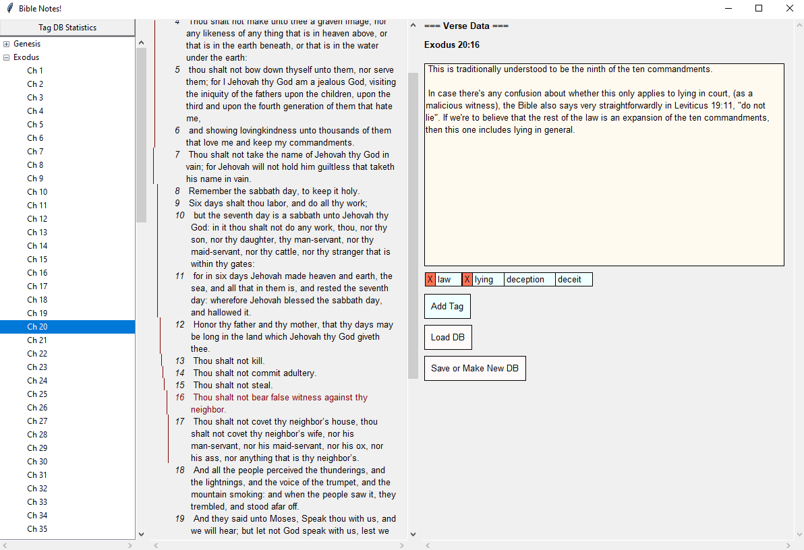
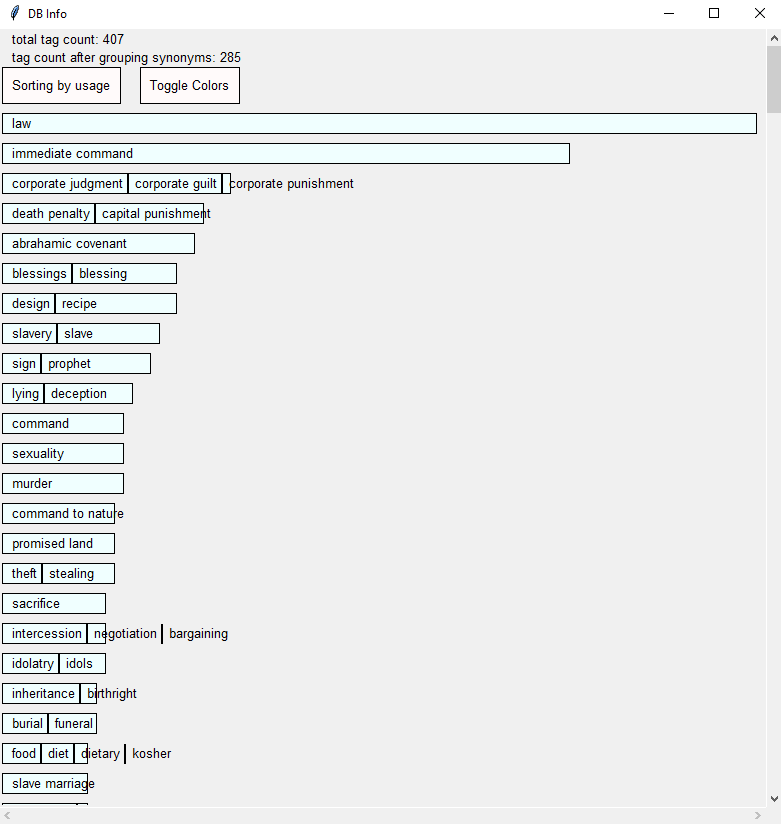

This is a Bible annotating program. It loads a JSON bible of your choice, (I programmed this around the output of SWORD-to-JSON. A copy of that is included in here), and lets you load/save/create a SQLite database with the following tables:

verses(), tags(), notes(), verse_tags(), verse_notes(), tag_notes(), tag_tags().

It's written in Python with TKinter, with a 3-column interface:
- The left column is a tree for navigating books and chapters.
- The middle column shows the text for one chapter, with vertical lines to show what verses have been annotated or tagged. You can click a verse (or shift-click to select multiple verses).
- The right column shows the selected verse(s), any notes you've written about that verse range, and a list of tags associated with the verse.

The columns are resizable (there's an invisible "sash" between each column that you can drag left and right).

If you click a tag, it'll show all the verses associated with that tag, and let you associate that tag with synonymous tags, just in case you make a mistake.
(e.g. maybe you made a tag called "eros" and another tag called "romance" and you want them to actually be the same category).

Known limitations:
- The tag-grouping in the "Tag DB Statistics" window is imperfect, and sometimes you'll see duplicate entries in the graph.
- If you create a DB while you have a weird Bible open (e.g. one with the Apocrypha included), and then open the same DB later with a normal bible, the books will all be indexed wrong, which can result in out-of-range errors. This problem won't manifest the same way with verses that include ranges where verse numbers are omitted (e.g. kjv vs niv), but may affect instances where a tag links to a single verse that is omitted, or the last verse in a chapter where a single verse has been omitted (idk).
  
