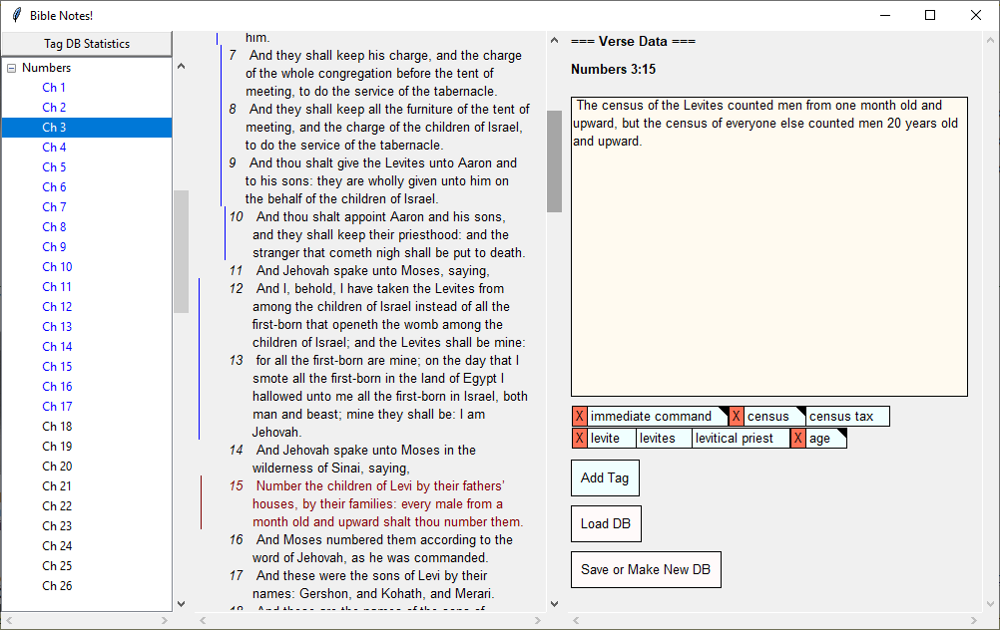
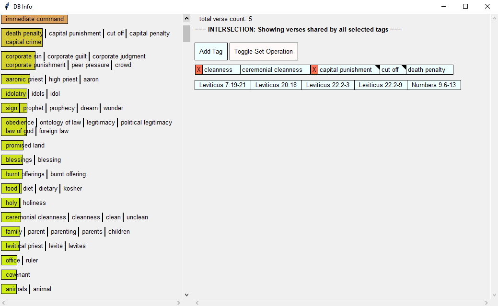

This is a tool for generating topical Bible concordances with notes. It loads a JSON bible of your choice, and then lets you add notes and "tags" to verses or passages. If you click a tag, it'll show all the verses associated with that tag, and let you associate that tag with synonymous tags so that you get all the verses for all of those tags in one place. (e.g. maybe you made a tag called "skin disease" on a bunch of verses and another tag called "leprosy" on a bunch of other verses, and you decide you want them to actually be in the same category; you would just mark them as synonyms). You can also add notes to your tags.

It's written in Python with TKinter, with a 3-column interface:
- The left column is a tree for navigating books and chapters.
- The middle column shows the text for one chapter, with vertical lines to show what verses have been annotated or tagged. You can click a verse (or shift-click to select multiple verses).
- The right column shows the selected verse(s), any notes you've written about that verse range, and a list of tags associated with the verse.

The columns are resizable (there's an invisible "sash" between each column that you can drag left and right).

I programmed this around the output of SWORD-to-JSON. Here's the link to that: https://github.com/wasdin/SWORD-to-JSON . A copy of it (which I had to modify to make it work for me) is included in here. 

Bible_Tagger outputs a SQLite database with the following tables:

verses(), tags(), notes(), verse_tags(), verse_notes(), tag_notes(), tag_tags().

Known limitations:
- If you create a DB while you have a weird Bible open (e.g. one with the Apocrypha included), and then open the same DB later with a normal bible, the books will all be indexed wrong, which can result in out-of-range errors. This problem won't manifest the same way with verses that include ranges where verse numbers are omitted (e.g. kjv vs niv), but may affect instances where a tag links to a single verse that is omitted, or the last verse in a chapter where a single verse has been omitted (idk).

To-Do List (not in any order):
- Add a tool to merge databases
- Make verse references in the DB more explicit so that the tool will accommodate switching between translations with missing verses
- Make it so that you don't have to select a verse before you load your DB
- Change the names of all of the canvases/panels (e.g. "canvas view" and "options panel") to something more intelligible in the code.
